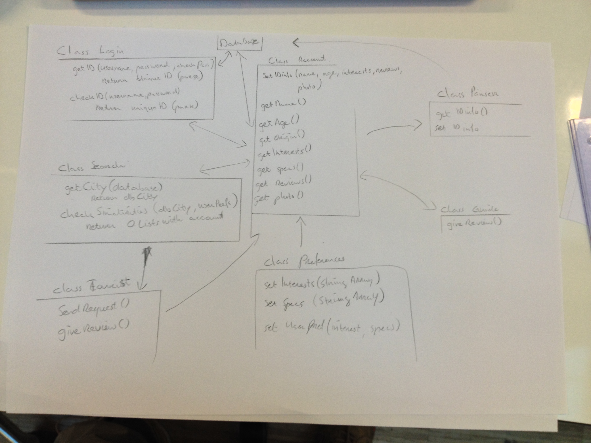
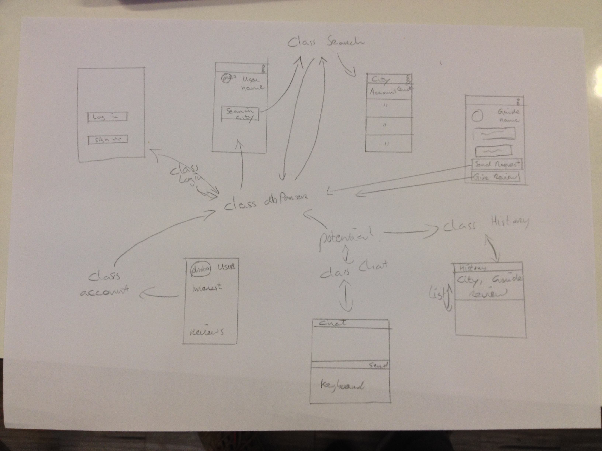

## DESIGN DOC.

#### Overview with the class and the methods. 

#### List with a class and methods
Class LogIn
	getID(username, password, checkPassword)
		return newUniqueID	

	checkID(username, password)
		return uniqueID (with extra info)

Class Account
	setIDspecs(name, age, origin, interests,, reviews, photo, availability, specifications)
		(set Info to database)
	getName()
		return name
	getAge()
		return age
	getOrigin()
		return origin
	getInterests()
		return interests
	getSpecs()
		return specifications
	getReviews()
		return reviews
	getAvailability()
		return  availability
	getPhoto()
		return photo	

Class Tour
	boolean tourist
	
	checkTourist()

Class Guide
	giveReview()

Class Tourist
	sendRequest()

	giveReview()

Class Preferences
	setInterests(StringArray)
		return userInterests
	
	setSpecs(StringArray)
		return userSpecs
	
	setDate(Date)
		return userDate

	setGroups(Int)
		return userGroups		

	setUserPrefs(userInterests, userSpecs, userDate, userGroups)
		return userPrefs

Class parser
	getIDinfo()
	getGuideInfo()

Class Search
	getCity(Database)
		return DatabaseCity
	checkSimilarities(DatabaseCity, UserPrefs)
		return Ordered List with accounts

Class Chat
	use PubNub or Q-municate, 
	more research is needed for this
	

Class History (Not MVP)
	later Research 
	
	

#### Sketches that show which UI are connected to which class. 

#### List of API's.
*Parse.com for databases and tables.

###### IN the future.
*Q-municate for chatting.
*PubNub for chatting.
