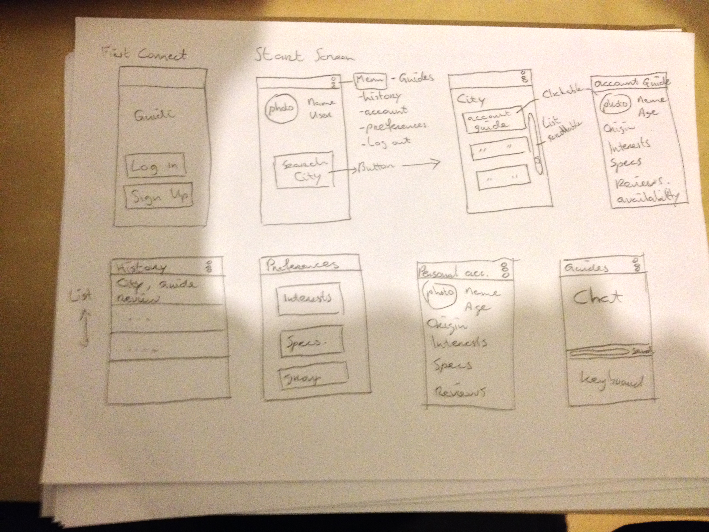

# project-guiri

AppName: Guidi 

Guidi is a platform which connects travellers with local people so they can arrange a meeting to show them around or go to events together.

##Features
###Tourists
* Get’s a tourits in contact with a local at the place its visiting, even before the tourist is going is at that location.
* Each tourist or guide has his own personal account.
* The tourist can compare accounts of locals and choose which seems them the  nicest.
* A rating system in the like of Uber / Couchsurfing to filter out rotten apples. 
* Possibility to selects on common interests.
* Acccount verification.

###Locals
* Get in contact with people all over the world.
* A good reason to get to know your city better.
* In exchange for money, food, free tickets the locals can take the tourists with them. 
* Possibility to select on common interests.
* Account verification. 
* Possibility to show availability guide.
* Possibility to get proper payment status when guides are reviewed good.

##Data Sets
* Personal reviews.
* Location specific accounts (Parse).

##External Components
* Parse. 
* Maps.
* Facebook.

##Problem Seperation
* Get in contact with locals in different citys.
* Be able to see who you are contacting, not as anonymous as craigslist.
* Choose a known guide and not a random touring agency.
* Be able to give feedback on a guide or a tourist.

##Development Problems
* Really big database. 
* App get’s really slow because of Maps. 
** Maybe need to dodge the use of Maps and only use GPS.

##Similar platforms / apps 
* Couchsurfing.
* Uber.
* Tinder.
* TourPal. 

##Overview with the activity's 

